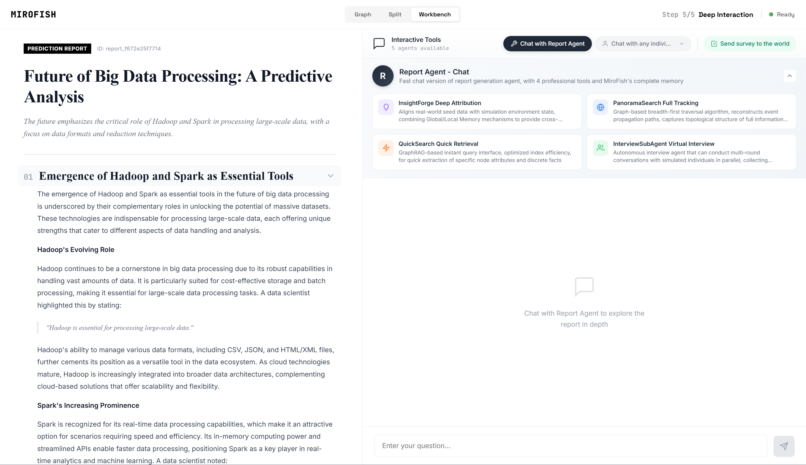
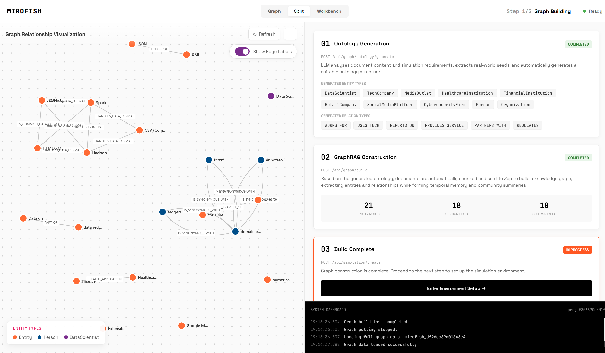
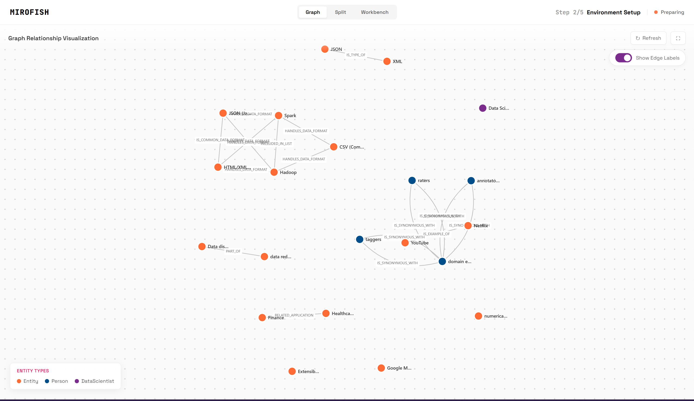
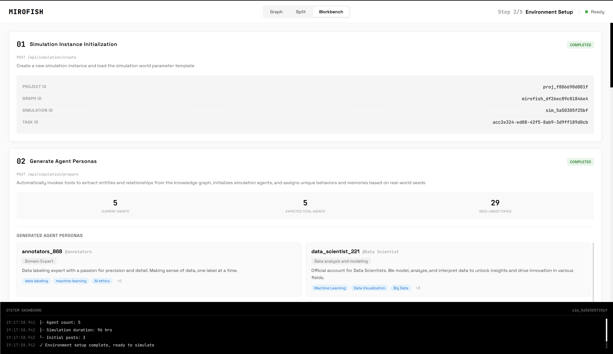
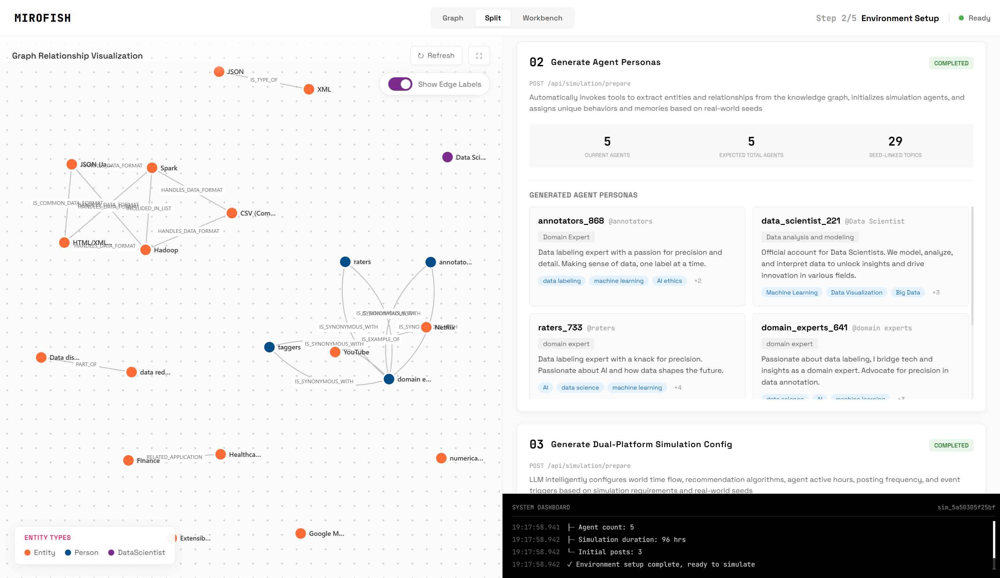
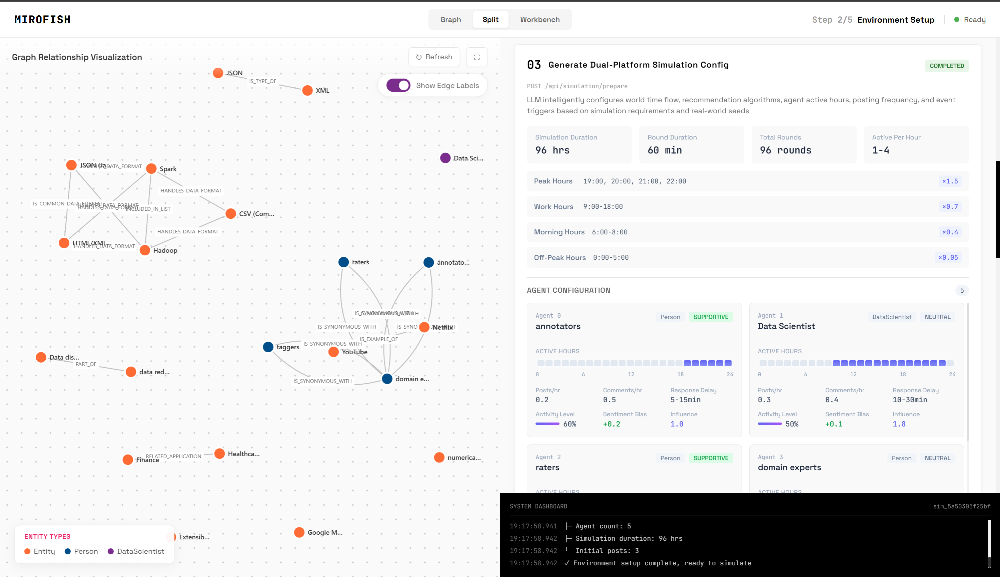

<div align="center">


一个简单通用的群体智能引擎，预测万物
</br>
<em>A Simple and Universal Swarm Intelligence Engine, Predicting Anything</em>

[English](./README.md) | [中文文档](./README-ZH.md)

</div>

## ⚡ 概述

**MiroFish** 是一个由多智能体技术驱动的下一代AI预测引擎。通过从现实世界提取种子信息（如突发新闻、政策草案或金融信号），它自动构建一个高保真的平行数字世界。在这个空间中，数千个具有独立个性、长期记忆和行为逻辑的智能体自由互动并经历社会演化。你可以从"上帝视角"动态注入变量，精确推演未来轨迹——**在数字沙盘中预演未来，在无数次模拟后赢得决策**。

> 你只需要：上传种子材料（数据分析报告或有趣的小说故事），并用自然语言描述你的预测需求
> MiroFish 将返回：一份详细的预测报告和一个深度可交互的高保真数字世界

### 我们的愿景

MiroFish 致力于创建一个映射现实的群体智能镜像。通过捕捉由个体互动引发的集体涌现，我们突破了传统预测的局限：

- **在宏观层面**：我们是决策者的预演实验室，让政策和公共关系在零风险中接受检验
- **在微观层面**：我们是个人用户的创意沙盒——无论是推演小说结局还是探索想象场景，一切都充满乐趣

从严肃的预测到有趣的模拟，我们让每一个"如果"都能看到结果，使预测万物成为可能。

## 📸 截图

<div align="center">
<table>
<tr>
<td></td>
<td></td>
</tr>
<tr>
<td></td>
<td></td>
</tr>
<tr>
<td></td>
<td></td>
</tr>
</table>
</div>

## 🔄 工作流程

1. **图谱构建**：现实世界种子提取 & 个体/集体记忆注入 & GraphRAG 构建
2. **环境设置**：实体关系提取 & 角色生成 & 智能体配置注入模拟参数
3. **模拟运行**：双平台并行模拟 & 自动解析预测需求 & 动态时序记忆更新
4. **报告生成**：ReportAgent 配备丰富工具集，与模拟后环境深度交互
5. **深度交互**：与模拟世界中的任意智能体对话 & 与 ReportAgent 互动

## 🚀 快速开始

### 源码部署

#### 前置要求

| 工具 | 版本 | 描述 | 检查安装 |
|------|---------|-------------|-------------------|
| **Node.js** | 18+ | 前端运行环境，包含 npm | `node -v` |
| **Python** | ≥3.11, ≤3.12 | 后端运行环境 | `python --version` |
| **uv** | 最新版 | Python 包管理器 | `uv --version` |

#### 1. 配置环境变量

```bash
# 复制示例配置文件
cp .env.example .env

# 编辑 .env 文件，填写所需的 API 密钥
```

**必需的环境变量：**

```env
# LLM API 配置（支持任何 OpenAI SDK 格式的 LLM API）
# 推荐：阿里云百炼平台的 Qwen-plus 模型：https://bailian.console.aliyun.com/
# 消耗较高，建议先用少于 40 轮的模拟进行尝试
LLM_API_KEY=your_api_key
LLM_BASE_URL=https://dashscope.aliyuncs.com/compatible-mode/v1
LLM_MODEL_NAME=qwen-plus

# Zep Cloud 配置
# 免费月度配额足够简单使用：https://app.getzep.com/
ZEP_API_KEY=your_zep_api_key
```

#### 2. 安装依赖

```bash
# 一键安装所有依赖（根目录 + 前端 + 后端）
npm run setup:all
```

或分步安装：

```bash
# 安装 Node 依赖（根目录 + 前端）
npm run setup

# 安装 Python 依赖（后端，自动创建虚拟环境）
npm run setup:backend
```

#### 3. 启动服务

```bash
# 启动前端和后端（从项目根目录运行）
npm run dev
```

**服务地址：**
- 前端：`http://localhost:3000`
- 后端 API：`http://localhost:5001`

**单独启动：**

```bash
npm run backend   # 仅启动后端
npm run frontend  # 仅启动前端
```

## 📄 致谢

本项目是 **[MiroFish](https://github.com/666ghj/MiroFish)** by **[666ghj](https://github.com/666ghj)** 的分支。我们衷心感谢原作者在群体智能预测引擎方面的创新工作。

MiroFish 的模拟引擎由 **[OASIS (Open Agent Social Interaction Simulations)](https://github.com/camel-ai/oasis)** 提供支持。衷心感谢 CAMEL-AI 团队的开源贡献！
